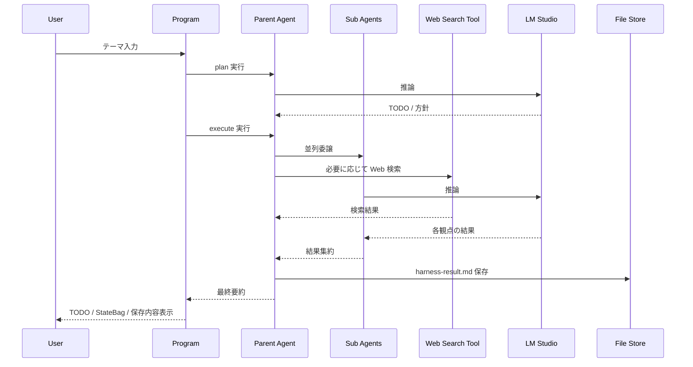

# HarnessSample

LM Studio の OpenAI 互換 API を使って Microsoft Agent Framework の Harness 機能を確認する .NET 10 サンプルです。

このリポジトリでは次をまとめて確認できます。

- `TodoProvider`
- `AgentModeProvider`
- `SubAgentsProvider`
- `FileMemoryProvider`
- `Tavily` / `TinyFish` ベースの Web 検索 Tool
- 対話ループによる複数テーマの試行

## リポジトリ構成

```text
.
├─ src/HarnessSample          # アプリ本体
├─ tests/HarnessSample.Tests  # xUnit によるユニットテスト
├─ scripts                    # API キー設定補助スクリプト
├─ docs                       # 仕様メモ、計画、記事下書き
└─ .github/workflows          # GitHub Actions CI
```

既定の solution は `HarnessSample.slnx` です。GitHub Actions では restore / build / test を自動実行します。

## 前提

- .NET SDK 10.0.203 以降
- LM Studio が起動していること
- OpenAI 互換 API が有効であること
- モデル `openai/gpt-oss-20b` が利用可能であること

現在の接続設定は [src/HarnessSample/HarnessSampleConfiguration.cs](src/HarnessSample/HarnessSampleConfiguration.cs) に固定しています。

- Endpoint: `http://localhost:1234/v1`
- Model: `openai/gpt-oss-20b`
- API Key: `sk-dummy`

## セットアップ

依存関係を復元します。

```powershell
dotnet restore HarnessSample.slnx
```

Web 検索 Tool を使う場合は、`.env.example` を参考にローカル環境で API キーを設定してください。

### Tavily

```powershell
$env:TAVILY_API_KEY = "your-tavily-api-key"
```

### TinyFish Search API

```powershell
$env:TINYFISH_API_KEY = "your-tinyfish-api-key"
$env:TINYFISH_LOCATION = "JP"
$env:TINYFISH_LANGUAGE = "ja"
```

補足:

- `TAVILY_API_KEY` がある場合、`provider=auto` は Tavily を優先
- Tavily 未設定で `TINYFISH_API_KEY` がある場合、TinyFish を使用
- `.env` は `.gitignore` で除外されるため、実キーはコミットされません

## 付属スクリプト

`scripts/` に API キー設定支援スクリプトを置いています。

### API キーを設定

```powershell
.\scripts\Set-HarnessSampleApiKeys.ps1 -TavilyApiKey "your-tavily-api-key" -Scope User
```

```powershell
.\scripts\Set-HarnessSampleApiKeys.ps1 -TinyFishApiKey "your-tinyfish-api-key" -TinyFishLocation "JP" -TinyFishLanguage "ja" -Scope User
```

### API キーを削除

```powershell
.\scripts\Remove-HarnessSampleApiKeys.ps1 -Scope User
```

### `.env` テンプレートを作成

```powershell
.\scripts\New-HarnessSampleEnvFile.ps1 -OutputPath ".env"
```

## ビルドとテスト

```powershell
dotnet build HarnessSample.slnx
```

```powershell
dotnet test tests/HarnessSample.Tests/HarnessSample.Tests.csproj
```

ユニットテストでは次を検証しています。

- `WebSearchService` の provider 解決
- `WebSearchService` の `MaxResults` クランプ
- `WebSearchToolConfiguration` の環境変数ロードと provider 判定

## 実行方法

```powershell
dotnet run --project src/HarnessSample/HarnessSample.csproj
```

起動後は入力例が表示されます。

- 番号を入力するとサンプルテーマを選択
- 任意の文字列を入力するとそのテーマで実行
- `exit` で終了

## 実行フロー



## 出力確認ポイント

- `TodoList` に plan / execute の進捗が出る
- `StateBag` に Harness の状態が入る
- `src/HarnessSample/bin/Debug/net10.0/agent-files/.../harness-result.md` が保存される
- API キー設定時は Web 検索 Tool が起動時に enabled と表示される

## 参考

- [docs/harness-sample-spec.md](docs/harness-sample-spec.md)
- [docs/harness-sample-plan.md](docs/harness-sample-plan.md)

## ライセンス

このリポジトリは MIT License の下で提供します。詳細は LICENSE を参照してください。
