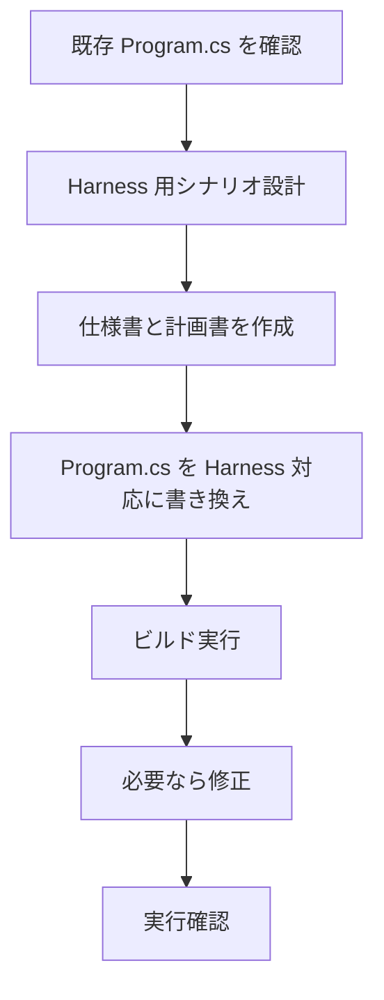
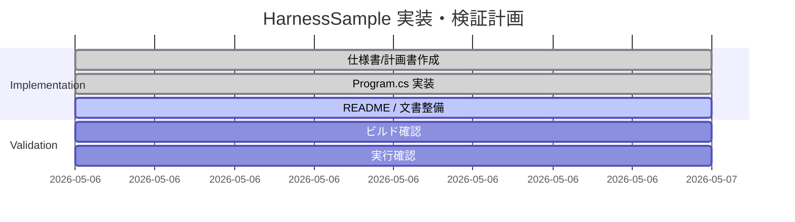

# HarnessSample 計画書

## 目的

Harness 公式サンプルの考え方を取り込みつつ、既存の LM Studio 接続設定でそのまま確認できる最小構成のサンプルを実装する。

## 方針

- 既存の `OpenAIClient` + `AsIChatClient()` 構成を維持する
- Harness の主要プロバイダーを `ChatClientAgentOptions.AIContextProviders` に追加する
- 実行シナリオは `plan` と `execute` の 2 段階に分ける
- Step02 を踏まえ、`SubAgentsProvider` による委譲も取り入れる
- 最終成果物を Markdown ファイルとして保存し、プログラム側で読み出して確認する

## 実施ステップ

## タスク一覧

| ID | タスク | 期待成果 |
| --- | --- | --- |
| P1 | 既存 LM Studio 設定の維持 | 接続先とモデル名を変更しない |
| P2 | Harness Provider 導入 | Todo / Mode / FileMemory を利用可能にする |
| P3 | SubAgents 導入 | 親エージェントから複数サブエージェントへ委譲可能にする |
| P4 | 実行フロー実装 | plan→execute の 2 段階実行と対話ループ |
| P5 | 可視化実装 | 応答、TODO、StateBag、保存ファイルを表示 |
| P6 | 検証 | ビルド成功、LM Studio で実行確認 |
| P7 | ドキュメント整備 | README と補助ドキュメントを整備 |

## 実装メモ

- `TodoProvider` で計画タスクを保持する
- `AgentModeProvider` の初期モードは `plan` とする
- `SubAgentsProvider` で概要・実装観点・レビュー観点を分担する
- `FileMemoryProvider` はセッションごとに別フォルダーを作る
- 保存ファイル名は `harness-result.md` に固定する

## リスクと対策

| リスク | 対策 |
| --- | --- |
| LM Studio が未起動 | 例外を捕捉して接続設定を表示する |
| モデルがツールを十分使わない | システム指示とユーザープロンプトで明示する |
| サブエージェントが使われない | execute 指示で並列委譲を必須にする |
| 実行結果の確認が難しい | TODO 一覧と保存ファイル内容をプログラム側で表示する |

## 検証方針

