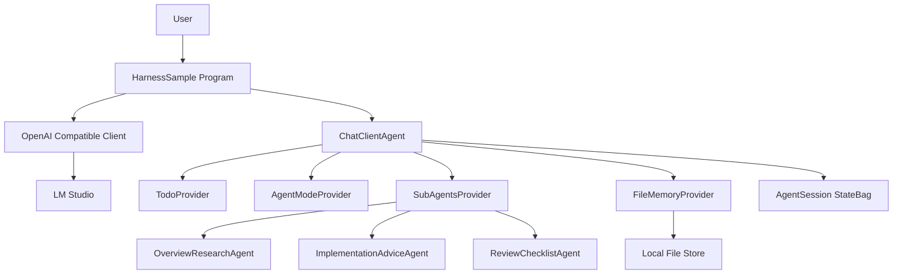
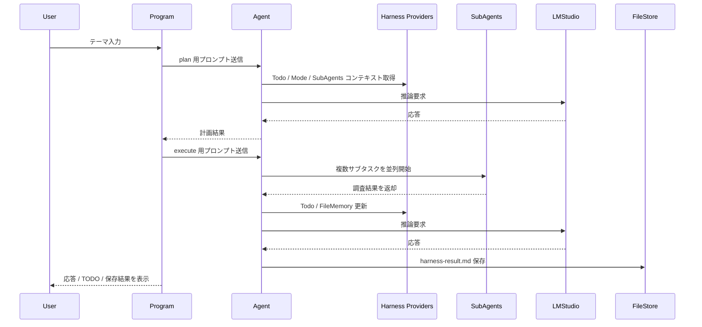

# HarnessSample 仕様書

## 概要

`HarnessSample` は Microsoft Agent Framework の Harness 系 AIContextProvider を使い、LM Studio の OpenAI 互換エンドポイントに接続して動作確認できる .NET 10 コンソールサンプルです。

このサンプルでは以下を確認します。

- LM Studio 接続設定を既存コードのまま再利用する
- `TodoProvider` によるタスク管理
- `AgentModeProvider` による `plan` / `execute` モード管理
- `SubAgentsProvider` によるサブエージェント委譲
- `FileMemoryProvider` による結果の Markdown 保存
- セッション状態の可視化
- 入力例付きの対話ループ

## 対象範囲

- 対象プロジェクト: `HarnessSample.csproj`
- 対象ファイル: `Program.cs`
- 出力先: `bin/.../agent-files/` 配下

## 接続要件

既存コードの LM Studio 設定をそのまま利用します。

- Endpoint: `http://localhost:1234/v1`
- Model: `openai/gpt-oss-20b`
- API Key: `sk-dummy`

## 実行シナリオ

1. コンソール起動時に入力例を表示し、調査テーマを受け付ける
2. plan モードで簡単な作業計画、TODO、サブエージェント利用方針を依頼する
3. execute モードで複数サブエージェントへ並列委譲し、結果整理と Markdown 保存を依頼する
4. 実行後に応答本文、TODO 一覧、StateBag、保存ファイル内容を表示する
5. ユーザーが `exit` を入力するまで対話ループを継続する

## 構成

## シーケンス

## 非機能要件

- 追加ライブラリは既存参照を優先する
- 実装は単一ファイル中心で最小変更に留める
- LM Studio 未起動時は例外内容を表示し、接続確認ポイントを案内する
- サブエージェントは同一 LM Studio 接続を再利用する

## 完了条件

- `dotnet build` が成功する
- LM Studio 稼働時に `HarnessSample` が実行できる
- 実行結果として TODO 状態、サブエージェント結果、保存ファイル確認ができる
