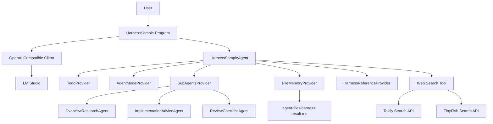
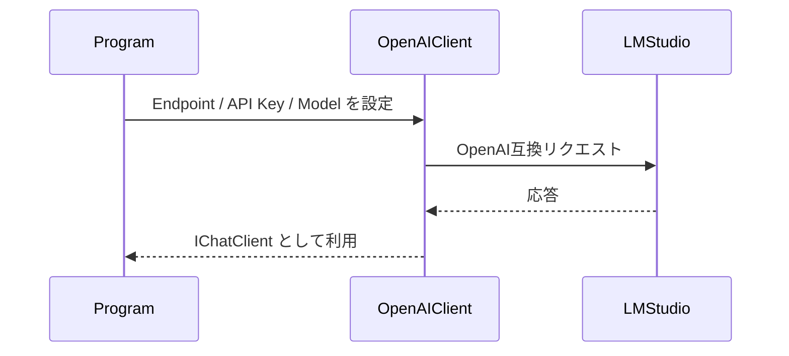
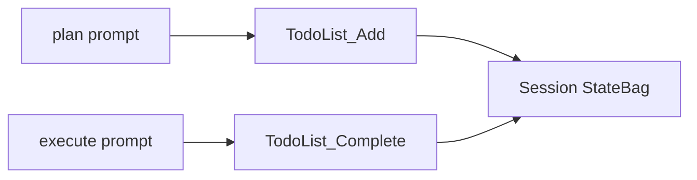
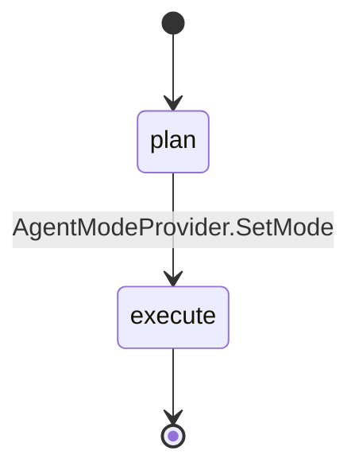
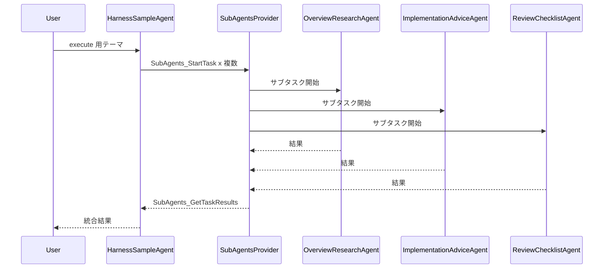
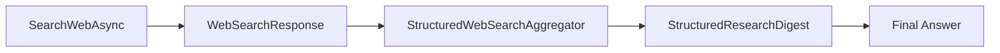
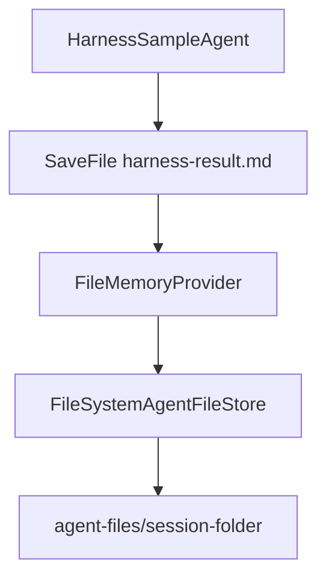
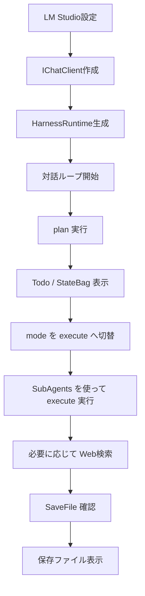

# はじめに

Microsoft Agent Framework の Harness サンプルを見ると、`TodoProvider`、`AgentModeProvider`、`SubAgentsProvider`、`FileMemoryProvider` のような仕組みを組み合わせて、少し長めの作業をエージェントに進めさせる構成になっています。

ただ、公式サンプルは Azure AI Foundry 前提のものもあり、まずは **ローカルの LM Studio で動かしたい** という場面があります。

このリポジトリ内の `HarnessSample` では、次の要素をまとめて確認できます。

- LM Studio の OpenAI 互換 API を使う
- `TodoProvider` で計画タスクを管理する
- `AgentModeProvider` で `plan` / `execute` を切り替える
- `SubAgentsProvider` でサブエージェントへ委譲する
- `FileMemoryProvider` で `harness-result.md` を保存する
- `Tavily` / `TinyFish` を使う Web検索 Tool を利用できる
- コンソールで対話ループしながら複数テーマを試す

対象プロジェクトは次です。

- `HarnessSample.csproj`
- `Program.cs`

# サンプルの全体像

このサンプルの全体像は次のとおりです。



親エージェント 1 つに対して、Harness 系の AIContextProvider を積んでいます。

さらに `SubAgentsProvider` の配下に 3 つのサブエージェントをぶら下げて、execute フェーズで役割分担させています。

# LM Studio の接続設定

このサンプルでは、既存コードの LM Studio 設定をそのまま使います。

`Program.cs` では次の設定を固定で使っています。

- Endpoint: `http://localhost:1234/v1`
- Model: `openai/gpt-oss-20b`
- API Key: `sk-dummy`

# Web検索 Tool の構成

HarnessSample では Web検索 Tool も利用できます。

有効化方法は環境変数ベースです。

## Tavily

```powershell
$env:TAVILY_API_KEY = "your-tavily-api-key"
```

## TinyFish

```powershell
$env:TINYFISH_API_KEY = "your-tinyfish-api-key"
$env:TINYFISH_LOCATION = "JP"
$env:TINYFISH_LANGUAGE = "ja"
```

この実装では、`provider=auto` のときに

1. Tavily
2. TinyFish

の順で使います。

TinyFish 側は OpenAPI ドキュメントから、次を前提にしています。

- Base URL: `https://api.search.tinyfish.ai`
- Header: `X-API-Key`
- Query parameter: `query`, `location`, `language`

Tavily 側は `POST /search` を使う基本構成にしています。

## 付属スクリプト

`scripts/` フォルダには、API キー設定を補助するスクリプトを用意しています。

- `Set-HarnessSampleApiKeys.ps1`
  - API キーを環境変数へ設定
- `Remove-HarnessSampleApiKeys.ps1`
  - API キーを削除
- `New-HarnessSampleEnvFile.ps1`
  - `.env` テンプレートを生成

```powershell
.\scripts\Set-HarnessSampleApiKeys.ps1 -TavilyApiKey "your-tavily-api-key" -Scope User
.\scripts\Remove-HarnessSampleApiKeys.ps1 -Scope User
.\scripts\New-HarnessSampleEnvFile.ps1 -OutputPath ".env"
```

`.env` 自体は `.gitignore` で除外し、`.env.example` だけを公開対象にしています。

接続の流れはシンプルです。



今回のサンプルでは、`OpenAIClient` から `GetChatClient(modelName)` を取り、`AsIChatClient()` で Agent Framework 側へ渡しています。

# Harness として確認できる要素

公式の Harness サンプル群では、大きく次の流れがあります。

- Step01: `TodoProvider` と `AgentModeProvider`
- Step02: `SubAgentsProvider`
- Step03: ファイル系プロバイダー

`HarnessSample` は、それらの考え方を 1 つのサンプルにまとめた構成です。

## 1. TodoProvider

`TodoProvider` は、エージェントに TODO を作成・更新・完了させるためのプロバイダーです。

このサンプルでは plan フェーズで TODO を作らせ、execute フェーズで完了した項目を閉じさせています。



コンソール側では `todoProvider.GetAllTodos(session)` を使って状態を表示し、モデルが本当に TODO を扱ったか確認できるようにしています。

## 2. AgentModeProvider

`AgentModeProvider` は、エージェントの現在モードを持つための仕組みです。

このサンプルでは次の 2 モードを使います。

- `plan`
- `execute`

流れとしては、最初に `plan` で実行し、その後プログラム側から `SetMode(session, "execute")` で切り替えています。



この分離を入れると、

- plan では「作業分解」と「方針決め」
- execute では「実際の委譲」と「成果物作成」

という責務を分けやすくなります。

## 3. SubAgentsProvider

公式 Step02 で出てくるのが `SubAgentsProvider` です。

親エージェントからサブエージェントへ仕事を振り、完了を待ち、結果を回収する流れを扱えます。

このサンプルでは、次の 3 エージェントを用意しています。

- `OverviewResearchAgent`
- `ImplementationAdviceAgent`
- `ReviewChecklistAgent`

役割は次のように分けています。

| サブエージェント | 役割 |
| --- | --- |
| OverviewResearchAgent | 概要、背景、重要ポイントを整理する |
| ImplementationAdviceAgent | 実装観点、使い方、設計の観点を整理する |
| ReviewChecklistAgent | 注意点、落とし穴、動作確認チェックを整理する |

execute フェーズでは、親エージェントに対して「少なくとも 2 つ以上のサブエージェントへ並列に依頼する」よう指示しています。



## 4. Web検索 Tool

Web検索 Tool は、Agent の通常 Tool として登録しています。

- `SearchWebAsync(query, provider, maxResults, notes)`

返り値は JSON 文字列で、内部的には次のような shape にしています。

```json
{
  "provider": "tavily",
  "query": "Microsoft Agent Framework Harness",
  "results": [
    {
      "position": 1,
      "title": "...",
      "url": "https://...",
      "snippet": "...",
      "siteName": "..."
    }
  ],
  "summary": "..."
}
```

さらに、検索結果をそのまま埋め込むだけでは不安定なので、`StructuredWebSearchAggregator` も追加しました。

これは structured output を使って、検索結果を次のような構造へ整形します。

- `Summary`
- `KeyFindings`
- `References`
- `Language`



## 5. FileMemoryProvider

`FileMemoryProvider` は、エージェントがファイルを保存・読込するための仕組みです。

このサンプルでは最終成果物を `harness-result.md` に保存します。

保存先は実行時の `bin/.../agent-files/<session-folder>/` 配下です。



また、モデルが保存しなかったケースも確認できるように、プログラム側で `EnsureResultFileSavedAsync(...)` を入れています。

# 事実ベースの補助コンテキスト

LM Studio のローカルモデルでは、テーマによって一般論や別文脈へ広がることがあります。

そのため、`HarnessReferenceProvider` という `AIContextProvider` を使い、次のようなローカル参照情報を system message として注入しています。

- 公式 Harness サンプル群の要点
- この `HarnessSample` 実装で使っている構成
- 接続先やモデル名
- 親エージェント名
- サブエージェント名
- SaveFile の保存先と狙い

これにより、回答を**このサンプル実装の事実**に寄せやすくしています。

# ファイル構成

実装は役割ごとにファイルを分けています。

- `Program.cs`
  - エントリポイント
- `HarnessSampleApp.cs`
  - 起動と対話ループ
- `HarnessRuntimeFactory.cs`
  - Agent / Provider / Tool 組み立て
- `HarnessScenarioRunner.cs`
  - plan / execute シナリオ実行
- `WebSearchService.cs`
  - Web検索 Tool 本体
- `WebSearchClients.cs`
  - Tavily / TinyFish 呼び出し
- `StructuredWebSearchAggregator.cs`
  - 検索結果の structured output 化

この構成により、Web検索部分の単体テストも行いやすくなっています。

# Program.cs の流れ

`Program.cs` の責務は次のとおりです。

1. LM Studio 接続を作る
2. 親エージェントとサブエージェントを組み立てる
3. 対話ループでテーマを受け付ける
4. plan を実行する
5. execute を実行する
6. 必要に応じて Web検索 Tool を使う
7. TODO / ChatHistory / StateBag / 保存ファイルを表示する



## HarnessRuntime の役割

`HarnessRuntime` は、1 テーマごとの実行単位に必要な要素をまとめて保持します。

- `AIAgent`
- `InMemoryChatHistoryProvider`
- `TodoProvider`
- `AgentModeProvider`
- `FileMemoryProvider`
- `SessionFolderPath`

これにより、1 回分の実行状態を分離して扱えます。

# 実行方法

LM Studio 側で OpenAI 互換 API を有効にし、`openai/gpt-oss-20b` をロードした状態で次を実行します。

```powershell
dotnet run --project HarnessSample.csproj
```

Web検索も使いたい場合は、先に API キーを設定します。

```powershell
$env:TAVILY_API_KEY = "your-tavily-api-key"
# または
$env:TINYFISH_API_KEY = "your-tinyfish-api-key"
$env:TINYFISH_LOCATION = "JP"
$env:TINYFISH_LANGUAGE = "ja"

dotnet run --project HarnessSample.csproj
```

起動すると入力例が表示されます。

- `1`, `2`, `3` の番号でサンプルテーマ選択
- 任意の文字列で自由入力
- `exit` で終了

# 動作確認項目

このサンプルでは、次の項目を確認しています。

1. `dotnet build HarnessSample.csproj` が成功する
2. `dotnet run --project HarnessSample.csproj` が起動する
3. plan / execute の 2 段階が動く
4. Web検索 Tool の有効 / 無効が起動時表示される
5. `harness-result.md` が保存される
6. TODO / StateBag / 保存ファイル内容が表示される

非対話入力をパイプした実行例は次のとおりです。

```powershell
"この HarnessSample 実装の使い方`nexit`n" | dotnet run --project HarnessSample.csproj
```

# 関連ドキュメント

関連ドキュメントは次のとおりです。

- `README.md`
- `docs/harness-sample-spec.md`
- `docs/harness-sample-plan.md`
- `docs/harness-sample-zenn.md`

README では実行方法と構成を、仕様書と計画書では設計意図と検証方針を整理しています。

# このサンプルの特徴

この `HarnessSample` は、Harness の各要素を小さくまとめて確認するのに向いています。

- Azure 前提ではなく LM Studio で試せる
- 1 プロジェクトで `Todo` / `Mode` / `SubAgents` / `FileMemory` を見られる
- API キー設定で Web検索 Tool まで試せる
- セッション状態をコンソールに出すので挙動を追いやすい
- SaveFile の結果をすぐ読める

# 拡張候補

拡張候補としては、たとえば次が挙げられます。

- `SubAgentsProvider` のタスク結果をより構造化して集約する
- 対話ループを簡易 CLI ではなく専用コマンド体系にする
- `FileAccessProvider` を足してローカルファイル解析まで広げる
- `ChatClientBuilder` ベースのパイプライン構成に寄せる
- テストしやすいように runtime 構築部分を別クラスへ分離する

# まとめ

LM Studio で Microsoft Agent Framework の Harness を試したいなら、まずは次の 4 要素をまとめて触ると全体像がつかみやすいです。

- `TodoProvider`
- `AgentModeProvider`
- `SubAgentsProvider`
- `FileMemoryProvider`
- `Web検索 Tool`

今回の `HarnessSample` は、その確認をローカル完結で行うためのサンプルです。

公式 Harness サンプルの考え方を取り込みつつ、LM Studio の OpenAI 互換エンドポイントで動かせるようにしているので、Harness を理解する入口として使いやすい構成になりました。
